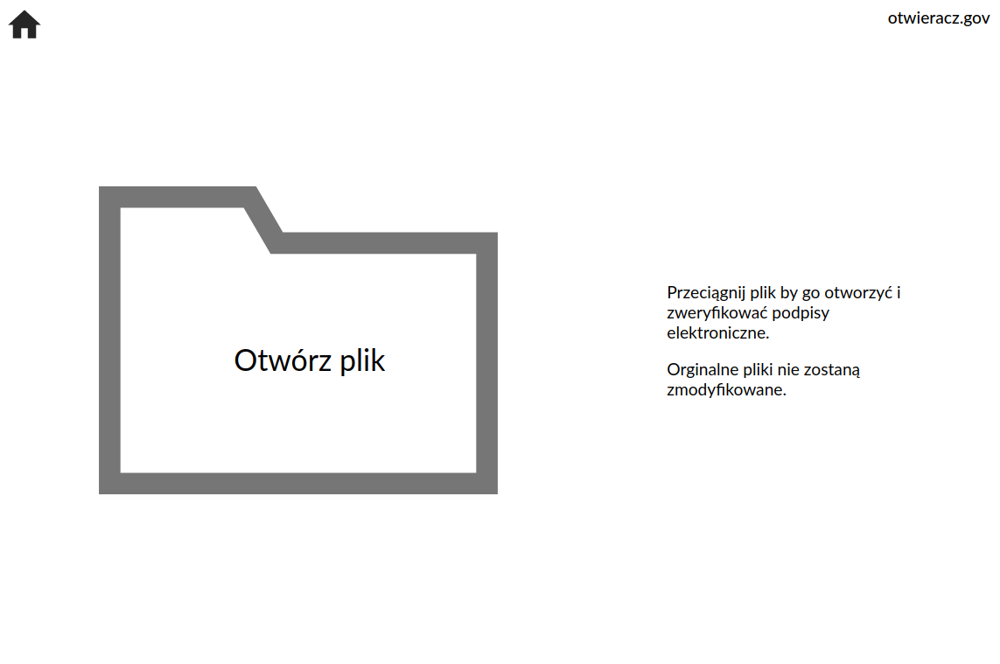

# Opener.gov for HackYeah



By:
- [Grzegorz ,,HakierGrzonzo'' Koperwas](https://github.com/HakierGrzonzo)
- [Kamil ,,Havystar'' Kowalczyk](https://github.com/Havystar)
- [Kamil Kowalski](https://github.com/Crustacean1)
- [Mateusz Leszczyński](https://github.com/LeszczynskiMateusz)

Designed by **Weronika Zmysłowska** in Silesia.

## What does this app do?

*opener.gov* allows you to simply drag and drop a file into it, and it will be opened in your
default program. *opener.gov* fixes any mistakes (or even malice) the author of the file had.

- If the file is compressed using 7zip, normal zip, GnuZip or even packed together with tar,
  it will be decompressed and unpacked.

- If the file is a digital signature in XML format, then the signature will be verified,
  user will be notified of a presence of a signatures (If the author of the document signs
  the file twice, we will show you that!), their authors and date.

- In whatever order the author of the document created the above, **our solution can handle that!**

- If the file is a PDF, then you can remove any text you would like, with some helpful
  suggestions thrown in!

- If the file is an XML document, you will see it in the correct form, a PIT will look like PIT
  should look.


## How to install for development:

You will need to have a modern version of python (with pip) and npm installed.

First run:

```
pip install -r opener/requirements.txt
```
to install dependencies for the backend.


Then run:
```
cd ./front; npm i
```
to install dependencies for the frontend.

### How to use for development:

To start the *backend* run `uvicorn opener:app --reload`
- On `/docs` you will find openapi documentation
- You can use the *CLI* version of our app by running `python -m opener path/to/file`

To start the *frontend* run:
```
cd ./front; npm start
```

